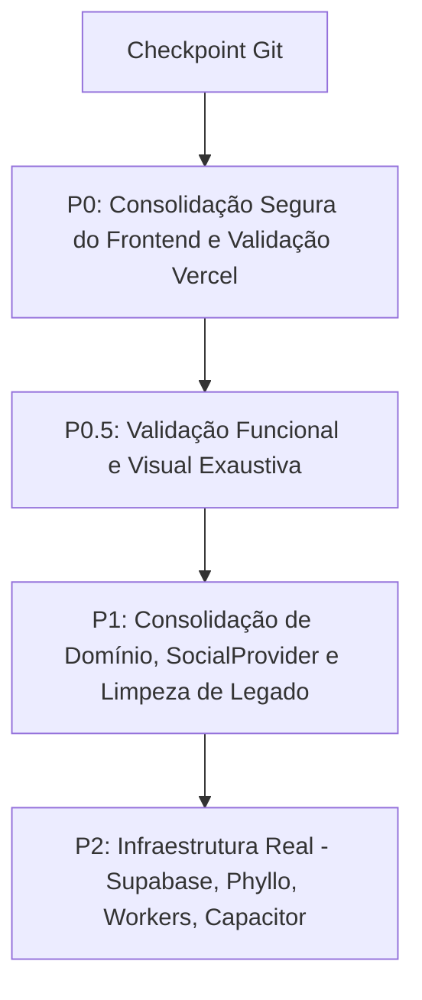

# Relatório de Auditoria & Plano Arquitetural Consolidado — UP Analytics / UP Creator

> **Data de Atualização:** 11 de Agosto de 2026  
> **Projeto:** UP Analytics / UP Creator  
> **Domínio Oficial:** `upideias.com` (Deploy em produção na Vercel)  
> **Objetivo:** Estabelecer a arquitetura oficial, consolidar os pacotes compartilhados, definir a abstração agnóstica de provedores sociais (`SocialProvider`) e preparar o caminho seguro para Supabase, Phyllo API, Workers e Capacitor sem alterar o visual, o comportamento ou quebrar o deploy existente na Vercel.

---

## 1. Arquitetura Alvo Oficial & Híbrida de Deploy

A estrutura final do projeto seguirá o modelo monorepo limpo, preservando o frontend na Vercel e preparando a infraestrutura backend/workers para VPS e Supabase (os diretórios de workers serão criados fisicamente apenas na fase P2):

```
                  ┌─────────────────────────────────────────┐
                  │            upideias.com                 │
                  └────────────────────┬────────────────────┘
                                       │
                                       ▼
                   ┌───────────────────────────────────────┐
                   │             VERCEL                    │
                   │  Root Build: apps/web                 │
                   │  Command: npm run build --workspace=  │
                   │           apps/web                    │
                   └───────────────────┬───────────────────┘
                                       │
            ┌──────────────────────────┼──────────────────────────┐
            ▼                          ▼                          ▼
┌───────────────────────┐  ┌───────────────────────┐  ┌───────────────────────┐
│       SUPABASE        │  │       VPS HÓSPEDE     │  │       PHYLLO API      │
│  PostgreSQL & Auth    │  │  Workers & Sync Jobs  │  │  Origem Métricas      │
└───────────────────────┘  └───────────────────────┘  └───────────────────────┘
```

### Árvore do Repositório:
```
app-upideias/
├── vercel.json                  # [DEPLOY VERCEL] buildCommand: npm run build --workspace=apps/web
├── package.json                 # Monorepo Workspaces: apps/*, packages/*
├── apps/
│   └── web/                     # Fonte ÚNICA do Frontend Web Responsivo (PWA/Capacitor-ready)
│       ├── src/
│       │   ├── app/             # Rotas Next.js 14 (App Router)
│       │   ├── components/      # Componentes do Dashboard, Landing, Admin e Creator
│       │   └── lib/             # Stores locais (Zustand/React Context)
│
├── workers/                     # [CONCEITO RESERVADO - CRIAR PASTAS FÍSICAS APENAS NA FASE P2]
│   ├── social-sync/             # Worker seguro para consumo/normalização de Phyllo & Meta API
│   └── ai-jobs/                 # Worker para tarefas assíncronas de IA e relatórios
│
├── packages/
│   ├── config/                  # tsconfig.base.json e configurações compartilhadas
│   ├── lib/                     # Client Supabase, SocialProvider, Services de Mocks/APIs
│   ├── types/                   # FONTE ÚNICA de Interfaces TypeScript (@up-analytics/types)
│   └── ui/                      # Design System / Primitivos visuais compartilhados (@up-analytics/ui)
│
├── supabase/
│   ├── migrations/              # Schemas SQL relacionais para PostgreSQL
│   └── seed.sql                 # Dados iniciais de seed
│
├── docs/                        # Documentação oficial, relatórios de auditoria e especificações
│
├── backend/                     # [REFERÊNCIA TEMPORÁRIA] Contém servidor FastAPI + MongoDB para consulta de lógica de IA e Mocks
├── AGENTS.md                    # [REGRA OFICIAL] Diretrizes e regras unificadas para agentes
```

---

## 2. Decisões Arquiteturais Consolidadas

### Decisão 1 — `apps/web` como Aplicação Oficial
- A aplicação `apps/web` é a fonte principal e única do frontend.
- O diretório `frontend/` é classificado como **legado** e só será removido na fase **P1**, após cumprir rigidamente 5 etapas de validação:
  1. Migração de qualquer arquivo útil ainda exclusivo dele (`error.tsx`, `not-found.tsx`);
  2. Validação de que `apps/web` possui 100% das funcionalidades necessárias;
  3. Validação do build local (`npm run build --workspace=apps/web`);
  4. Validação de que o deploy da Vercel compila sem dependência de `frontend/`;
  5. Validação visual e de responsividade.

### Decisão 2 — Estratégia Mobile via Web Responsivo + Capacitor
- A estratégia oficial é: **Web Responsivo → Capacitor → Android / iOS**.
- O projeto `apps/mobile/` (Expo / React Native) está descontinuado.
- Sua remoção só ocorrerá em **P1**, após busca exaustiva por referências confirmando que não há código funcional ou exclusivo nele.
- Nenhuma dependência do Capacitor será instalada nesta etapa.

### Decisão 3 — `packages/types` como Fonte Única da Verdade
- Eliminação gradual dos arquivos de tipos duplicados (`apps/web/src/lib/types.ts` e `frontend/src/lib/types.ts`).
- Todos os componentes e serviços passarão a importar de `@up-analytics/types`.
- Os arquivos duplicados só serão deletados após refatoração dos imports e confirmação da compilação do TypeScript.

### Decisão 4 — Domínio Agnóstico de Plataforma Social (`Social*`)
Para não engessar o sistema apenas no Instagram (permitindo futura expansão para TikTok, YouTube, LinkedIn, X, etc. via Phyllo API), evoluiremos os modelos de dados mantendo **aliasing de compatibilidade** para não quebrar as telas atuais:

- `SocialPlatform` = `'instagram' | 'tiktok' | 'youtube' | 'linkedin' | 'x'`
- `SocialAccount` (contém `platform: SocialPlatform`) — *alias:* `type InstagramAccount = SocialAccount`
- `SocialAccountMetrics` (métricas diárias de conta) — *alias:* `type InstagramDailyMetrics = SocialAccountMetrics`
- `SocialContent` (posts, reels, vídeos) — *alias:* `type InstagramMedia = SocialContent`
- `SocialContentMetrics` (engajamento por conteúdo) — *alias:* `type InstagramMediaMetrics = SocialContentMetrics`
- `AudienceMetrics` (modelo explícito em `camelCase` para a camada frontend idiomática do TypeScript).

### Decisão 5 — Interface `SocialProvider` Idiomática em `camelCase` (sem `any`)
A camada de abstração de dados sociais utilizará camelCase idiomático no frontend. A normalização da Phyllo fará a conversão de `snake_case` → `camelCase` na camada de entrada do provedor:

```typescript
export type SocialPlatform = 'instagram' | 'tiktok' | 'youtube' | 'linkedin' | 'x';

export interface AudienceMetrics {
  accountId: string;
  platform: SocialPlatform;
  ageDistribution: Record<string, number>;
  genderDistribution: Record<string, number>;
  topCities: Array<{ city: string; country: string; percentage: number }>;
  topCountries: Array<{ country: string; percentage: number }>;
  peakActiveHours: Array<{ hour: number; dayOfWeek: number; engagementScore: number }>;
  updatedAt: string;
}

export interface SocialProvider {
  connectAccount(platform: SocialPlatform): Promise<SocialAccount>;
  getAccount(accountId: string): Promise<SocialAccount>;
  getAccountMetrics(accountId: string, periodDays: number): Promise<SocialAccountMetrics[]>;
  getContent(accountId: string): Promise<SocialContent[]>;
  getContentMetrics(contentId: string): Promise<SocialContentMetrics[]>;
  getAudience(accountId: string): Promise<AudienceMetrics>;
}
```
O frontend jamais conhecerá a estrutura bruta das respostas da Phyllo API ou Meta Graph API.

### Decisão 6 — Phyllo como Provedor de Dados em Camada Traseira
O fluxo de dados da arquitetura final será obrigatoriamente:
$$\text{Phyllo API} \longrightarrow \text{Backend / Worker Seguro} \longrightarrow \text{Normalização (camelCase)} \longrightarrow \text{PostgreSQL (Supabase)} \longrightarrow \text{UP Analytics (Web UI)}$$
O frontend do UP Analytics **nunca consumirá a Phyllo API diretamente**. Todos os dados coletados serão salvos em nosso banco PostgreSQL para geração de histórico proprietário.

### Decisão 7 — Camada Segura de Backend / Workers (Não apenas Supabase Client)
O cliente JavaScript do Supabase no browser **não substitui o backend**. Operações que exigem segurança total rodarão exclusivamente em ambiente seguro (Workers em VPS, Edge Functions ou serviços Node):
- `PHYLLO_CLIENT_SECRET` e tokens de infraestrutura;
- Webhooks de recebimento da Phyllo / Meta / Stripe;
- `EMERGENT_LLM_KEY` / Chaves do Gemini IA;
- Jobs de sincronização agendada e cron de métricas;
- Normalização e regras de negócio administrativas.

### Decisão 8 — Audit do Backend Python (`backend/server.py`)
O diretório `backend/` **não será excluído nesta etapa**. Ele servirá como catálogo de referência para:
- Prompts e esquemas de resposta da IA Gemini (`/api/ai/insight`, `/api/ai/ideas`, `/api/ai/caption`);
- Regras de bloqueio de brute-force e autenticação;
- Formatos de métricas simuladas do Instagram e automações de WhatsApp.

### Decisão 9 — Deploy na Vercel & Domínio Oficial (`upideias.com`)
- O projeto possui deploy ativo na Vercel para o domínio oficial **`upideias.com`**.
- O arquivo `vercel.json` na raiz do repositório define a configuração oficial de build:
  - `buildCommand`: `npm run build --workspace=apps/web`
  - `outputDirectory`: `apps/web/.next`
- A consolidação **preservará a produção em 100% dos passos**.
- O diretório `frontend/` **não é utilizado** no build da Vercel (o build utiliza diretamente `apps/web`).

---

## 3. Matriz de Riscos da Migração

| Risco | Nível | Causa Potencial | Estratégia de Mitigação |
|---|---|---|---|
| **Quebra do deploy na Vercel** | Alto | Alteração incorreta em `vercel.json` ou dependências do monorepo | Preservar `vercel.json` com `npm run build --workspace=apps/web` e validar resolução dos pacotes `packages/*`. |
| **Quebra de compilação por tipos ausentes** | Médio | Remoção precoce de `apps/web/src/lib/types.ts` | Manter aliases retrocompatíveis (`InstagramAccount` = `SocialAccount`) em `@up-analytics/types`. |
| **Página sem tratamento de erro** | Baixo | Falta de componentes `error.tsx` no App Router | Copiar imediatamente os arquivos de tratamento de erro do `frontend/` em **P0**. |
| **Quebra de responsividade ou visual** | Médio | Edição de classes Tailwind ou wrappers JSX | **Proibição estrita** de alterações no CSS ou estrutura JSX das telas durante a consolidação. |

---

## 4. Plano de Execução Sequencial Priorizado



### 📍 Checkpoint Git Obrigatório (Antes de iniciar P0)
```bash
git status
git add .
git commit -m "chore: checkpoint before architecture consolidation"
git push
```

### 📍 P0 — Consolidação Segura do Frontend & Validação Vercel (EXCLUSIVO DESTE PASSO)
1. Copiar `error.tsx` e `not-found.tsx` de `frontend/src/app/` para `apps/web/src/app/`.
2. Redirecionar os imports de tipos em `apps/web` para apontar diretamente para a biblioteca compartilhada `@up-analytics/types`.
3. Eliminar duplicações puras de declarações de tipos mantendo aliases para compatibilidade.
4. Executar verificação de tipos e compilação completa: `npm run build --workspace=apps/web`.
5. Validar que nenhuma variável sensível está hardcoded e que nenhuma URL temporária de deploy da Vercel está fixada no código.
6. Garantir que a resolução de `packages/*` no monorepo atenda integralmente o comando de build da Vercel (`npm run build --workspace=apps/web`).
7. **Relatório P0:** Entregar lista detalhada de cada arquivo alterado e o resultado exato do build.
8. **Regra de Ouro:** Não alterar nenhum estilo, cor, layout ou código de componente funcional existente. Não avançar para P0.5, P1 ou P2 sem autorização expressa.

### 📍 P0.5 — Validação Funcional e Visual Exaustiva (Futuro)
- Testar 100% das rotas e validar responsividade em Mobile (~390px), Tablet (~768px), Desktop (>=1024px).

### 📍 P1 — Consolidação de Domínio e Services (Futuro)
- `packages/types` como fonte única com `SocialPlatform` ('x'), `Social*` e `AudienceMetrics` (`camelCase`).
- Isolamento/remoção segura dos diretórios `frontend/` e `apps/mobile/` após checagens.

### 📍 P2 — Infraestrutura Real (Sub-passos Sequenciais)
- **P2.1 — Supabase / PostgreSQL:** Conexão e configuração das migrações do banco relacional.
- **P2.2 — Auth Definitiva:** Transição para Supabase Auth (Google OAuth).
- **P2.3 — Phyllo API:** Conexão do SDK/APIs de dados sociais.
- **P2.4 — Workers VPS:** Implementação de `workers/social-sync` e `workers/ai-jobs` para tarefas privadas.
- **P2.5 — Gemini IA Oficial:** Integração do SDK oficial do Google Gemini AI.
- **P2.6 — Remoção do Emergent:** Desacoplamento completo de dependências legadas do Emergent Agent.
- **P2.7 — Capacitor:** Configuração e empacotamento da Web Responsiva para Android e iOS.
